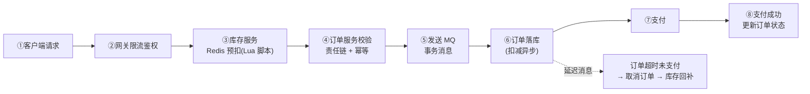

# 秒购（MiaoGo）技术架构

> 本文描述的是**目标架构（Phase 5 / 6 完成态）**。实际开发按 `单体 → 渐进演进` 推进，并非一上来就全套微服务——各组件的引入时机见下方「组件清单与引入阶段」。

> 同时提供可拖拽编辑的 draw.io 版本：[架构图.drawio](架构图.drawio)（VSCode 装 *Draw.io Integration* 插件即可双击编辑，可导出 PNG/SVG）。

## 整体架构图

```mermaid
flowchart TB
    %% ===== 客户端 =====
    subgraph CLIENT["客户端"]
        direction LR
        C1["移动端 App / H5"]
        C2["PC 端"]
        C3["小程序"]
        C4["第三方渠道"]
    end

    %% ===== 接入层 =====
    subgraph ACCESS["接入层"]
        direction TB
        EDGE["CDN → WAF/防火墙 → DDoS 防护 → SLB 负载均衡"]
        GW["统一网关 Spring Cloud Gateway<br/>路由转发 · 鉴权JWT · 限流熔断(Sentinel) · 协议转换 · 灰度发布 · 请求日志"]
        EDGE --> GW
    end

    %% ===== 服务治理与配置中心 =====
    subgraph GOVERN["服务治理与配置中心"]
        direction TB
        NACOS_R["Nacos 注册中心"]
        NACOS_C["Nacos 配置中心"]
        SENTINEL["Sentinel 限流/熔断/降级"]
        SEATA["Seata 分布式事务"]
        FEIGN["OpenFeign 服务调用"]
        SKYWALKING["SkyWalking 链路追踪"]
    end

    %% ===== 服务层（微服务） =====
    subgraph APP["服务层（微服务）"]
        direction LR
        SVC_USER["用户服务<br/>信息/登录/资产"]
        SVC_PRODUCT["商品服务<br/>商品/类目/品牌"]
        SVC_STOCK["库存服务<br/>查询/预扣/回补"]
        SVC_ORDER["订单服务 ★核心链路★<br/>下单校验(责任链)<br/>订单创建(异步)<br/>订单状态机(状态模式)<br/>幂等控制"]
        SVC_PAY["支付服务<br/>下单/回调/流水"]
        SVC_MKT["营销服务<br/>优惠券/秒杀活动/积分"]
        SVC_SEARCH["搜索服务<br/>商品索引/搜索/聚合"]
    end

    %% ===== 中间件层 =====
    subgraph MID["中间件层（核心能力）"]
        direction LR
        MQ["RocketMQ<br/>下单请求/订单事件/积分券 Topic<br/>事务·顺序·延迟·死信"]
        CACHE["多级缓存<br/>Redis Cluster (预扣/热点/分布式锁)<br/>Caffeine 本地缓存 L1"]
        LOCK["Redisson 分布式锁<br/>下单幂等锁 · 优惠券限领锁<br/>库存互斥锁 · 热点重建锁"]
    end

    %% ===== 数据层 =====
    subgraph DATA["数据层"]
        direction LR
        MYSQL["MySQL 主从<br/>InnoDB / 事务 / MVCC / 索引优化"]
        SHARD["ShardingSphere 分库分表<br/>订单库(user_id 分片) + 商家冗余表(merchant_id 分片)<br/>全局ID:雪花/号段 · 同步:Canal Binlog/MQ"]
        ES["Elasticsearch 集群<br/>商品索引/倒排索引/聚合/高亮/分页"]
    end

    %% ===== 基础设施与可观测 =====
    subgraph INFRA["基础设施与可观测性"]
        direction LR
        PROM["Prometheus + Grafana<br/>QPS/RT/错误率/线程池/连接池/缓存命中/MQ积压"]
        ELK["ELK<br/>Logstash→ES→Kibana 日志检索"]
        SKYOAP["SkyWalking OAP<br/>Trace/拓扑/告警"]
        OSS["对象存储 OSS/MinIO<br/>图片/文件"]
        XXLJOB["XXL-JOB<br/>分布式定时调度"]
    end

    %% ===== 开发与运维 =====
    subgraph DEVOPS["开发与运维"]
        direction LR
        GIT["GitHub 代码托管"]
        DOCKER["Docker 容器化"]
        NGINX["Nginx 反向代理"]
        K8S["K8s 容器编排(可选)"]
        JMETER["JMeter 压测"]
    end

    %% ===== 连线 =====
    CLIENT --> ACCESS
    GW --> APP
    APP -.注册/配置/治理.-> GOVERN
    APP --> MID
    APP --> DATA
    SVC_SEARCH --> ES
    SVC_ORDER -->|事务消息/异步落库| MQ
    SVC_STOCK -->|预扣/回补| MQ
    MQ -->|消费/积分/通知/核销| SVC_MKT
    MQ -.延迟消息:超时取消+库存回补.-> SVC_ORDER
    XXLJOB -->|超时订单兜底| SVC_ORDER
    APP -.指标/日志/追踪.-> INFRA
    DEVOPS --> APP
    JMETER -.压测施压.-> GW
```

## 核心链路（秒杀下单流程）

## 组件清单与引入阶段

| 分层 | 组件 | 作用 | 引入阶段 |
|---|---|---|---|
| 接入层 | Nginx | 负载均衡、反向代理 | Phase 5 |
| 接入层 | Spring Cloud Gateway | 统一入口、路由、鉴权、限流 | Phase 5 |
| 注册/配置 | Nacos | 服务注册发现、配置中心 | Phase 5 |
| 服务治理 | Sentinel | 限流、熔断、降级 | Phase 5 |
| 服务治理 | Seata | 跨服务分布式事务（AT/TCC/Saga） | Phase 5 |
| 服务治理 | SkyWalking | 分布式链路追踪 | Phase 5/6 |
| 应用框架 | Java 17 + Spring Boot 3.x | 业务骨架 | Phase 0 |
| 持久层 | MyBatis-Plus | ORM / CRUD | Phase 0 |
| 服务调用 | OpenFeign | 服务间 HTTP 调用 | Phase 5 |
| 异步 | RocketMQ | 削峰、解耦、事务消息、延迟消息 | Phase 3 |
| 调度 | XXL-JOB | 分布式定时任务（替代单机 @Scheduled） | Phase 5 |
| 缓存 | Caffeine | L1 本地缓存 | Phase 2 |
| 缓存 | Redis 7.x | L2 缓存、库存预扣（Lua 原子） | Phase 1/2 |
| 分布式锁 | Redisson | 秒杀防超卖、幂等、限领 | Phase 1 |
| 数据库 | MySQL 8.x | 业务数据存储 | Phase 0 |
| 分库分表 | ShardingSphere | 订单按 user_id 分片 + 商家冗余表 | Phase 4 |
| 搜索 | Elasticsearch | 商品搜索、倒排索引 | Phase 4 |
| 监控 | Prometheus + Grafana | QPS/RT/错误率/线程池/缓存命中率 | Phase 6 |
| 日志 | ELK | 统一日志、按 traceId 串全链路 | Phase 6 |
| 压测 | JMeter | 每阶段优化前后对比验证 | 全程 |
| 工程化 | Git + GitHub Actions + Docker | 版本管理、CI/CD、镜像构建 | 全程 |

## 应用服务划分（Phase 5 拆分边界）

| 服务 | 职责 | 对应单体模块 |
|---|---|---|
| 用户服务 | 用户、账户余额、登录态 | `com.miaogo.user` |
| 商品服务 | 商品信息、详情页 | `com.miaogo.product` |
| 库存服务 | 库存扣减/回补（秒杀核心） | `com.miaogo.stock` |
| 订单服务 | 下单、订单状态机、查询 | `com.miaogo.order` |
| 支付服务 | 支付流水、回调 | `com.miaogo.payment` |
| 营销服务 | 优惠券、秒杀活动、积分 | `com.miaogo.marketing` |
| 搜索服务 | 商品搜索（ES） | `com.miaogo.search` |

> 单体阶段这些都是同一个工程里的顶层包；Phase 5 按此表把每个包拆成独立微服务，依赖边界提前在模块化单体阶段理清。
